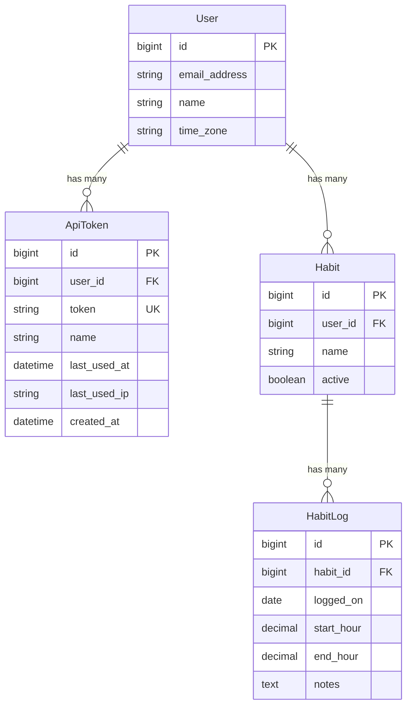

# CLI Tool with API Token Authentication

## Overview

Build a CLI tool for wrap that allows agents (like Claude) to create habit logs via API. This requires:
1. API token authentication system with self-service UI
2. JSON API endpoints under `/api/v1/` namespace
3. Thor-based CLI tool for interacting with the API

## Problem Statement / Motivation

Currently, habit logs can only be created through the web UI. To enable AI agents to log habits on behalf of users, we need:
- A programmatic API that doesn't rely on browser cookies/sessions
- Token-based authentication that agents can use
- A CLI tool that agents can invoke

## Proposed Solution

### Architecture Overview

```
┌─────────────┐     ┌──────────────────┐     ┌─────────────┐
│  CLI Tool   │────▶│   /api/v1/*      │────▶│   Database  │
│  (Thor gem) │     │  (Rails JSON API)│     │             │
└─────────────┘     └──────────────────┘     └─────────────┘
       │                    │
       │                    ▼
       │            ┌──────────────────┐
       └───────────▶│   ApiToken       │
        Bearer token│   (auth lookup)  │
                    └──────────────────┘
```

### Component Breakdown

1. **ApiToken Model** - Stores tokens linked to users
2. **Api::V1::BaseController** - Handles token auth, sets `Current.user`
3. **Api::V1::HabitsController** - GET /api/v1/habits
4. **Api::V1::HabitLogsController** - POST /api/v1/habits/:habit_id/logs
5. **ApiTokensController** - Web UI for token management
6. **CLI Tool** - Thor-based Ruby CLI in `lib/wrap_cli/`

## Technical Approach

### Phase 1: API Token Model

Create `ApiToken` model with `has_secure_token`:

```ruby
# db/migrate/XXXXXX_create_api_tokens.rb
class CreateApiTokens < ActiveRecord::Migration[8.1]
  def change
    create_table :api_tokens do |t|
      t.references :user, null: false, foreign_key: true
      t.string :token, null: false
      t.string :name
      t.datetime :last_used_at
      t.string :last_used_ip
      t.timestamps
    end

    add_index :api_tokens, :token, unique: true
  end
end
```

```ruby
# app/models/api_token.rb
class ApiToken < ApplicationRecord
  belongs_to :user

  has_secure_token

  validates :name, length: { maximum: 100 }

  def touch_usage!(ip_address)
    update_columns(last_used_at: Time.current, last_used_ip: ip_address)
  end
end
```

```ruby
# app/models/user.rb (addition)
has_many :api_tokens, dependent: :destroy
```

### Phase 2: API Authentication Concern

```ruby
# app/controllers/concerns/api_authentication.rb
module ApiAuthentication
  extend ActiveSupport::Concern

  included do
    before_action :authenticate_api_token!
  end

  private

  def authenticate_api_token!
    token = extract_bearer_token
    return render_unauthorized unless token

    api_token = ApiToken.find_by(token: token)
    return render_unauthorized unless api_token

    api_token.touch_usage!(request.remote_ip)
    Current.user = api_token.user
  end

  def extract_bearer_token
    auth_header = request.headers["Authorization"]
    return nil unless auth_header&.start_with?("Bearer ")
    auth_header.split(" ").last
  end

  def render_unauthorized
    render json: { error: "Unauthorized" }, status: :unauthorized
  end
end
```

### Phase 3: API Controllers

```ruby
# app/controllers/api/v1/base_controller.rb
module Api
  module V1
    class BaseController < ActionController::API
      include ApiAuthentication

      rescue_from ActiveRecord::RecordNotFound, with: :render_not_found

      private

      def render_not_found
        render json: { error: "Not found" }, status: :not_found
      end

      def render_validation_errors(record)
        render json: { errors: record.errors.as_json }, status: :unprocessable_entity
      end
    end
  end
end
```

```ruby
# app/controllers/api/v1/habits_controller.rb
module Api
  module V1
    class HabitsController < BaseController
      def index
        habits = Current.user.habits.order(active: :desc, name: :asc)
        render json: habits.map { |h| habit_json(h) }
      end

      private

      def habit_json(habit)
        {
          id: habit.id,
          name: habit.name,
          description: habit.description,
          color: habit.color,
          active: habit.active
        }
      end
    end
  end
end
```

```ruby
# app/controllers/api/v1/habit_logs_controller.rb
module Api
  module V1
    class HabitLogsController < BaseController
      before_action :set_habit

      def create
        log = @habit.habit_logs.build(habit_log_params)

        if log.save
          render json: habit_log_json(log), status: :created
        else
          render_validation_errors(log)
        end
      end

      private

      def set_habit
        @habit = Current.user.habits.find(params[:habit_id])
      end

      def habit_log_params
        params.permit(:logged_on, :start_hour, :end_hour, :notes)
      end

      def habit_log_json(log)
        {
          id: log.id,
          habit: { id: log.habit.id, name: log.habit.name },
          logged_on: log.logged_on.iso8601,
          start_hour: log.start_hour,
          end_hour: log.end_hour,
          duration_hours: log.end_hour - log.start_hour,
          notes: log.notes,
          created_at: log.created_at.iso8601
        }
      end
    end
  end
end
```

### Phase 4: API Routes

```ruby
# config/routes.rb (addition)
namespace :api do
  namespace :v1 do
    resources :habits, only: [:index] do
      resources :logs, only: [:create], controller: "habit_logs"
    end
  end
end
```

### Phase 5: Token Management UI

```ruby
# app/controllers/api_tokens_controller.rb
class ApiTokensController < ApplicationController
  def index
    @api_tokens = current_user.api_tokens.order(created_at: :desc)
  end

  def create
    @api_token = current_user.api_tokens.create!(name: params[:name])
    @show_token = @api_token.token # Only available immediately after creation

    respond_to do |format|
      format.turbo_stream
      format.html { redirect_to api_tokens_path, notice: "Token created" }
    end
  end

  def destroy
    token = current_user.api_tokens.find(params[:id])
    token.destroy

    respond_to do |format|
      format.turbo_stream { render turbo_stream: turbo_stream.remove(token) }
      format.html { redirect_to api_tokens_path, notice: "Token revoked" }
    end
  end
end
```

```ruby
# config/routes.rb (addition)
resources :api_tokens, only: [:index, :create, :destroy]
```

**Views needed:**
- `app/views/api_tokens/index.html.erb` - List tokens with create form
- `app/views/api_tokens/create.turbo_stream.erb` - Show new token once
- `app/views/api_tokens/_api_token.html.erb` - Token partial for list

### Phase 6: CLI Tool (Thor-based)

```ruby
# lib/wrap_cli.rb
require "thor"
require "net/http"
require "json"
require "yaml"

module WrapCli
  class CLI < Thor
    CONFIG_PATH = File.expand_path("~/.config/wrap/config.yml")

    desc "configure", "Configure CLI with API token"
    def configure
      print "Enter your API token: "
      token = $stdin.gets.chomp

      print "Enter API base URL [http://localhost:3000]: "
      url = $stdin.gets.chomp
      url = "http://localhost:3000" if url.empty?

      save_config(token: token, base_url: url)
      puts "Configuration saved to #{CONFIG_PATH}"
    end

    desc "habits", "List all habits"
    def habits
      response = api_get("/api/v1/habits")
      habits = JSON.parse(response.body)

      habits.each do |h|
        status = h["active"] ? "" : " (inactive)"
        puts "#{h['id']}: #{h['name']}#{status}"
      end
    end

    desc "log HABIT_ID START_HOUR END_HOUR", "Create a habit log"
    option :date, type: :string, desc: "Date (YYYY-MM-DD), defaults to today"
    option :notes, type: :string, desc: "Optional notes"
    def log(habit_id, start_hour, end_hour)
      payload = {
        start_hour: start_hour.to_f,
        end_hour: end_hour.to_f,
        logged_on: options[:date] || Date.today.iso8601,
        notes: options[:notes]
      }.compact

      response = api_post("/api/v1/habits/#{habit_id}/logs", payload)

      if response.code == "201"
        result = JSON.parse(response.body)
        puts "Logged #{result['duration_hours']}h of #{result['habit']['name']} on #{result['logged_on']}"
      else
        error = JSON.parse(response.body)
        puts "Error: #{error['error'] || error['errors']}"
        exit 1
      end
    end

    private

    def config
      @config ||= YAML.load_file(CONFIG_PATH)
    rescue Errno::ENOENT
      puts "Not configured. Run: wrap configure"
      exit 1
    end

    def api_get(path)
      uri = URI("#{config['base_url']}#{path}")
      request = Net::HTTP::Get.new(uri)
      request["Authorization"] = "Bearer #{config['token']}"
      request["Content-Type"] = "application/json"
      Net::HTTP.start(uri.hostname, uri.port) { |http| http.request(request) }
    end

    def api_post(path, body)
      uri = URI("#{config['base_url']}#{path}")
      request = Net::HTTP::Post.new(uri)
      request["Authorization"] = "Bearer #{config['token']}"
      request["Content-Type"] = "application/json"
      request.body = body.to_json
      Net::HTTP.start(uri.hostname, uri.port) { |http| http.request(request) }
    end

    def save_config(data)
      FileUtils.mkdir_p(File.dirname(CONFIG_PATH))
      File.write(CONFIG_PATH, data.to_yaml)
      File.chmod(0600, CONFIG_PATH)
    end
  end
end
```

```ruby
# bin/wrap
#!/usr/bin/env ruby
require_relative "../lib/wrap_cli"
WrapCli::CLI.start(ARGV)
```

## Acceptance Criteria

### API Token Management
- [x] Users can generate new API tokens from settings UI
- [x] Token is displayed only once at creation time
- [x] Users can name tokens for identification
- [x] Users can see list of tokens with last_used_at, partial token display
- [x] Users can revoke tokens
- [x] Revoked tokens immediately stop working

### API Endpoints
- [x] `GET /api/v1/habits` returns user's habits as JSON
- [x] `POST /api/v1/habits/:habit_id/logs` creates habit log
- [x] Invalid/missing token returns 401 Unauthorized
- [x] Accessing another user's habit returns 404
- [x] Validation errors return 422 with error details

### CLI Tool
- [x] `wrap configure` saves token and base URL to `~/.config/wrap/config.yml`
- [x] `wrap habits` lists all habits with ID and name
- [x] `wrap log <habit_id> <start> <end>` creates a log
- [x] `wrap log` supports `--date` and `--notes` options
- [x] CLI shows clear error messages for failures

## File Changes Summary

### New Files
| File | Purpose |
|------|---------|
| `db/migrate/XXXXXX_create_api_tokens.rb` | ApiToken table |
| `app/models/api_token.rb` | ApiToken model |
| `app/controllers/concerns/api_authentication.rb` | Bearer token auth |
| `app/controllers/api/v1/base_controller.rb` | API base controller |
| `app/controllers/api/v1/habits_controller.rb` | GET habits endpoint |
| `app/controllers/api/v1/habit_logs_controller.rb` | POST logs endpoint |
| `app/controllers/api_tokens_controller.rb` | Token management UI |
| `app/views/api_tokens/index.html.erb` | Token list page |
| `app/views/api_tokens/_api_token.html.erb` | Token partial |
| `app/views/api_tokens/create.turbo_stream.erb` | Token creation response |
| `lib/wrap_cli.rb` | CLI tool implementation |
| `bin/wrap` | CLI executable |
| `test/controllers/api/v1/habits_controller_test.rb` | API tests |
| `test/controllers/api/v1/habit_logs_controller_test.rb` | API tests |
| `test/models/api_token_test.rb` | Model tests |

### Modified Files
| File | Change |
|------|--------|
| `app/models/user.rb` | Add `has_many :api_tokens` |
| `config/routes.rb` | Add API namespace and api_tokens routes |

## ERD



## Security Considerations

- Tokens stored using `has_secure_token` (plaintext but indexed for fast lookup)
- API controllers inherit from `ActionController::API` (no CSRF protection needed)
- All queries scoped through `Current.user` preventing IDOR
- Token shown only once at creation; users must copy immediately
- CLI stores token with 0600 file permissions (user-only access)
- `last_used_at` and `last_used_ip` tracked for audit purposes

## Testing Strategy

1. **Model tests**: ApiToken validations, `touch_usage!` method
2. **Controller tests**: Auth success/failure, CRUD operations, error responses
3. **Integration tests**: Full flow from CLI → API → database

## Future Considerations (Out of Scope)

- Token expiration/rotation
- Token scopes/permissions (read-only vs write)
- Rate limiting on API endpoints
- Batch log creation endpoint
- Creating/updating habits via API
- Publishing CLI as a RubyGem to RubyGems.org

## References

### Internal References
- Authentication concern: `app/controllers/concerns/authentication.rb`
- Session model pattern: `app/models/session.rb:4` (`has_secure_token`)
- Existing JSON responses: `app/controllers/tags_controller.rb:11-23`
- JBuilder patterns: `app/views/habits/_habit.json.jbuilder`

### External References
- Thor CLI framework: https://github.com/rails/thor
- Rails API-only controllers: https://guides.rubyonrails.org/api_app.html
- has_secure_token: https://api.rubyonrails.org/classes/ActiveRecord/SecureToken/ClassMethods.html
