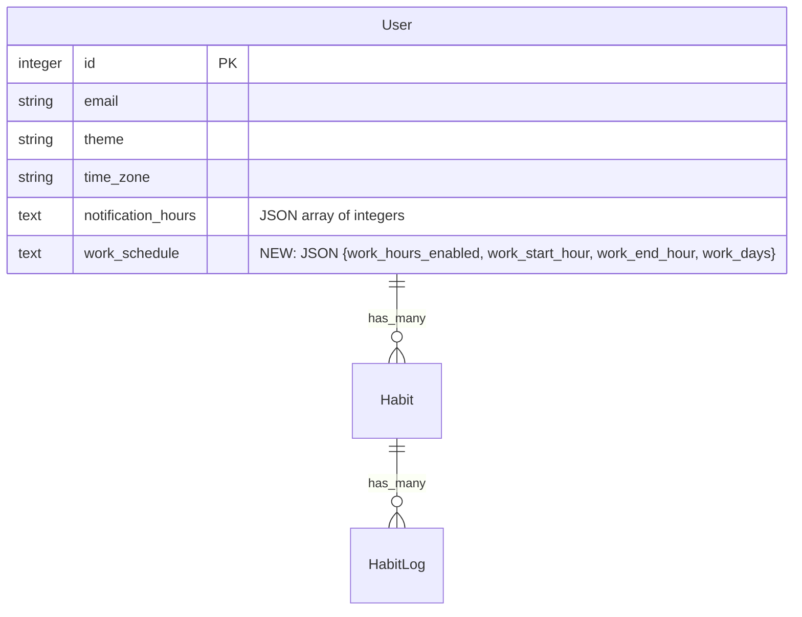

# feat: Work Hours Configuration

Configure virtual work hours that display on the timeline as grayed-out blocks without persisting to the database or affecting insights.

---

## Enhancement Summary

**Deepened on:** 2025-01-07
**Research agents used:** DHH Rails Reviewer, Kieran Rails Reviewer, Code Simplicity Reviewer, Architecture Strategist, Pattern Recognition Specialist, Performance Oracle, Security Sentinel, Data Integrity Guardian, Agent-Native Reviewer, Best Practices Researcher, Framework Docs Researcher

### Key Improvements
1. **Simplified architecture**: Replace WorkBlock Struct with simple `work_hour?(hour)` boolean check
2. **Better data model**: Use TEXT column with `serialize` (matches existing `notification_hours` pattern)
3. **Enhanced validation**: Add range validation, type coercion, and array sanitization
4. **Performance optimizations**: Memoize visibility check, precompute coverage map
5. **Security hardening**: Input validation, JSON sanitization, type casting

### Critical Changes from Original Plan
| Original | Improved | Reason |
|----------|----------|--------|
| WorkBlock Struct with segment calculation | Simple `work_hour?(hour)` boolean | Over-engineering - CSS background doesn't need object system |
| JSON column type | TEXT with `serialize` | SQLite compatibility, matches existing pattern |
| Minimal validation | Full range + type validation | Prevent data corruption |
| No JSON sanitization | `before_save` sanitizer | Prevent arbitrary key injection |

---

## Overview

Users can configure their typical work schedule (working days and hours) in Settings. The dashboard timeline displays these configured hours as shaded/grayed blocks—as if a "Work" habit had been logged—without actually persisting HabitLogs. Real habit logs take precedence over virtual work blocks, and work hours are completely excluded from all statistics and insights.

## Problem Statement / Motivation

Wrap is designed for accounting for your time, but working hours naturally fill large chunks of the day. Currently, users either:
1. Don't track work hours (leaving large gaps on the timeline)
2. Manually log work hours as a habit (cluttering insights with non-habit data)

Work isn't really a habit—it's a baseline schedule that other activities fit around. This feature provides visual context for the workday without polluting habit statistics.

## Proposed Solution

### Settings Page
Add a "Work Schedule" section to Settings with:
- **Enable toggle**: Show/hide work hours on timeline (default: OFF)
- **Day selector**: Toggle buttons for each day (default: Mon-Fri)
- **Time range**: Start/end hour dropdowns with 30-min increments (default: 9am-5pm)

### Timeline Display
- Apply CSS background class to hours within work range
- Real habit logs render on top (natural z-index layering)
- No separate "work block" objects needed

### Data Model
```ruby
# Migration: TEXT column (matches notification_hours pattern)
add_column :users, :work_schedule, :text, default: "{}", null: false

# User model with serialize
serialize :work_schedule, coder: JSON
```

---

## Technical Approach

### Phase 1: Data Model & Settings UI

**Migration** (`db/migrate/xxx_add_work_schedule_to_users.rb`)
```ruby
class AddWorkScheduleToUsers < ActiveRecord::Migration[8.1]
  def change
    add_column :users, :work_schedule, :text, default: "{}", null: false
  end
end
```

### Research Insights: Data Model

**Best Practices (from Rails documentation):**
- Use `serialize` with TEXT columns for SQLite compatibility
- Rails `store` with `coder: JSON` provides IndifferentAccess for symbol/string keys
- Always include `null: false` to prevent accessor nil errors

**Edge Cases:**
- Empty hash `{}` is safer default than `nil`
- SQLite stores JSON as TEXT internally—no native JSON indexing benefits
- Migration is reversible but rollback permanently deletes data

---

**User Model** (`app/models/user.rb`)

```ruby
# Serialization (matches existing notification_hours pattern)
serialize :work_schedule, coder: JSON

# Allowed keys for sanitization
ALLOWED_WORK_SCHEDULE_KEYS = %w[
  work_hours_enabled work_start_hour work_end_hour work_days
].freeze

# Accessors with type coercion and defaults
def work_hours_enabled?
  ActiveModel::Type::Boolean.new.cast(work_schedule&.dig("work_hours_enabled"))
end

def work_start_hour
  (work_schedule&.dig("work_start_hour") || 9.0).to_d
end

def work_end_hour
  (work_schedule&.dig("work_end_hour") || 17.0).to_d
end

def work_days
  work_schedule&.dig("work_days") || [1, 2, 3, 4, 5]
end

def work_day?(date)
  work_days.include?(date.wday)
end

# Simple predicate for timeline rendering
def work_hour?(hour)
  work_hours_enabled? && hour >= work_start_hour && hour < work_end_hour
end

# Validations
validate :work_schedule_valid
before_save :sanitize_work_schedule

private

def work_schedule_valid
  return unless work_hours_enabled?

  unless work_start_hour.between?(0, 24)
    errors.add(:base, "Work start hour must be between 0 and 24")
  end

  unless work_end_hour.between?(0, 24)
    errors.add(:base, "Work end hour must be between 0 and 24")
  end

  if work_start_hour >= work_end_hour
    errors.add(:base, "Work end hour must be after start hour")
  end

  if work_days.present?
    unless work_days.is_a?(Array) && work_days.all? { |d| d.is_a?(Integer) && d.between?(0, 6) }
      errors.add(:base, "Work days must be valid day numbers (0-6)")
    end
  end
end

def sanitize_work_schedule
  return if work_schedule.blank?
  self.work_schedule = work_schedule.slice(*ALLOWED_WORK_SCHEDULE_KEYS)
end
```

### Research Insights: User Model

**DHH Rails Review:**
> "You are solving a CSS background color problem with object-oriented design patterns. Delete the Struct. Ask 'is this a work hour?' and apply a CSS class."

**Security (from Security Sentinel):**
- Add `before_save :sanitize_work_schedule` to prevent arbitrary key injection
- Explicit type casting prevents string "false" being truthy
- Validate array contents to prevent type confusion

**Pattern Recognition:**
- Use `work_hours_enabled?` with `?` suffix (Ruby predicate convention)
- Use `dig` for nil-safe hash access
- `ALLOWED_WORK_SCHEDULE_KEYS` constant prevents schema pollution

---

**Settings Form** (`app/views/settings/show.html.erb`)

```erb
<%# Add after Notifications section %>
<div class="nb-card mt-6">
  <%= form_with model: current_user, url: settings_path, method: :patch do |form| %>
    <div class="mb-4">
      <h2 class="text-2xl font-black">Work Schedule</h2>
      <p class="mt-1 text-sm text-black/70">
        Configure your typical work hours to see them on the timeline.
      </p>
    </div>

    <div class="mb-4">
      <label class="nb-label flex items-center gap-2 cursor-pointer">
        <%= form.check_box :work_hours_enabled,
            { checked: current_user.work_hours_enabled? },
            "true", "false" %>
        <span>Show work hours on timeline</span>
      </label>
    </div>

    <div class="grid gap-4 sm:grid-cols-2 mb-4">
      <div>
        <%= form.label :work_start_hour, "Start Time", class: "nb-label" %>
        <%= form.select :work_start_hour,
            work_hour_options,
            { selected: current_user.work_start_hour },
            class: "nb-input mt-2 w-full" %>
      </div>
      <div>
        <%= form.label :work_end_hour, "End Time", class: "nb-label" %>
        <%= form.select :work_end_hour,
            work_hour_options,
            { selected: current_user.work_end_hour },
            class: "nb-input mt-2 w-full" %>
      </div>
    </div>

    <div class="mb-6">
      <p class="nb-label mb-2">Work Days</p>
      <%= hidden_field_tag "user[work_days][]", "" %>
      <div class="flex flex-wrap gap-2">
        <% day_toggle_options.each do |name, value| %>
          <label class="cursor-pointer">
            <%= check_box_tag "user[work_days][]", value,
                current_user.work_days.include?(value),
                id: "work_day_#{value}",
                class: "peer sr-only" %>
            <div class="peer-checked:nb-btn--yellow nb-btn nb-btn--white
                        px-3 py-2 text-sm font-bold
                        peer-checked:ring-2 peer-checked:ring-black">
              <%= name %>
            </div>
          </label>
        <% end %>
      </div>
    </div>

    <div>
      <%= form.submit "Save work schedule", class: "nb-btn nb-btn--yellow" %>
    </div>
  <% end %>
</div>
```

### Research Insights: Settings Form

**UX Best Practices:**
- Toggle buttons for days (more scannable than checkboxes)
- Dropdown selects for time (prevents invalid input)
- Hidden field for empty array submission: `hidden_field_tag "user[work_days][]", ""`
- Show duration feedback as users adjust times

**Accessibility:**
- Use `sr-only` for visually hidden checkbox with styled label
- Ensure focus states are visible
- Day abbreviations fit mobile screens

---

**Settings Controller** (`app/controllers/settings_controller.rb`)

```ruby
def settings_params
  params.require(:user).permit(
    :theme,
    :work_hours_enabled,
    :work_start_hour,
    :work_end_hour,
    notification_hours: [],
    work_days: []
  )
end
```

### Research Insights: Controller

**Agent-Native Architecture:**
Add JSON response format for API access:

```ruby
def update
  if current_user.update(settings_params)
    respond_to do |format|
      format.html { redirect_to settings_path, notice: "Settings updated." }
      format.json { render json: current_user.slice(:theme, :work_schedule), status: :ok }
    end
  else
    respond_to do |format|
      format.html { render :show, status: :unprocessable_entity }
      format.json { render json: current_user.errors, status: :unprocessable_entity }
    end
  end
end
```

---

### Phase 2: Timeline Display (Simplified)

**DaySummary Extension** (`app/models/day_summary.rb`)

```ruby
# Simple check - no Struct, no segment calculation
def work_hour?(hour)
  return false unless user.work_hours_enabled? && user.work_day?(date)
  hour >= user.work_start_hour && hour < user.work_end_hour
end

# Memoized visibility check (called 18 times per render)
def work_hours_visible?
  return @work_hours_visible if defined?(@work_hours_visible)
  @work_hours_visible = user.work_hours_enabled? && user.work_day?(date)
end
```

### Research Insights: DaySummary

**Performance Oracle:**
> "Reorder conditionals for early exit. For an 8-hour workday, 10 of 18 calls (55%) exit immediately on the first check."

**DHH Rails Review:**
> "The view should just ask: 'Is this hour within work hours?' and render a background. Done. No Struct. No polymorphism."

**Simplified approach**: The original plan's `work_block_segments_for_hour` method with overlap detection is unnecessary. Real habit blocks render on top of the work hour background via CSS z-index. No segment splitting needed.

---

**Timeline Partial** (`app/views/dashboard/_timeline.html.erb`)

```erb
<%# Line 21 - add work hour class to existing hour row %>
<div class="timeline-hour flex border-b border-black/10 relative
            <%= section_bg %>
            <%= 'work-hour-bg' if day.work_hour?(hour) %>"
     style="height: 60px;"
     data-hour="<%= hour %>">
```

**CSS Styling** (`app/assets/stylesheets/application.css`)

```css
.work-hour-bg {
  background: repeating-linear-gradient(
    -45deg,
    transparent,
    transparent 4px,
    rgba(0, 0, 0, 0.04) 4px,
    rgba(0, 0, 0, 0.04) 8px
  );
}
```

### Research Insights: Timeline Display

**Code Simplicity Review:**
> "Work hour indicators are just a background visual—they can show regardless of whether habits overlap. Let CSS layering handle it (z-index already exists)."

**Accessibility:**
- Pattern (stripes) provides non-color indicator
- Sufficient contrast maintained
- Works with all 3 themes

---

### Phase 3: Helper Methods

**Settings Helper** (`app/helpers/settings_helper.rb`)

```ruby
def work_hour_options
  (6..24).flat_map do |hour|
    options = [[format_hour(hour.to_d), hour.to_d]]
    options << [format_hour(hour + 0.5), (hour + 0.5).to_d] if hour < 24
    options
  end
end

def day_toggle_options
  %w[Sun Mon Tue Wed Thu Fri Sat].each_with_index.map { |name, i| [name, i] }
end

def format_hour(decimal_hour)
  hours = decimal_hour.to_i
  minutes = ((decimal_hour % 1) * 60).to_i
  period = hours >= 12 ? "pm" : "am"
  display_hour = hours % 12
  display_hour = 12 if display_hour == 0

  if minutes > 0
    "#{display_hour}:#{minutes.to_s.rjust(2, '0')}#{period}"
  else
    "#{display_hour}#{period}"
  end
end
```

---

## Acceptance Criteria

### Settings Page
- [ ] Work Schedule section appears in Settings page after Notifications
- [ ] Toggle enables/disables work hours display (default: OFF for new users)
- [ ] Day buttons toggle individually (default: Mon-Fri selected)
- [ ] Time dropdowns show 30-minute increments (6am-midnight)
- [ ] Validation prevents end_hour <= start_hour with clear error message
- [ ] Settings persist across page reloads
- [ ] JSON API endpoint returns work_schedule for agent access

### Timeline Display
- [ ] Work hour background appears on configured days only
- [ ] Work hours render as diagonal stripe pattern (visually distinct from habits)
- [ ] Real habit logs render on top of work hour background
- [ ] Work hour styling works with all 3 themes (default, monochrome, catppuccin)
- [ ] Mobile touch interactions work normally in work hour areas

### Statistics Exclusion
- [ ] Total hours excludes work hours (automatic - not in HabitLog table)
- [ ] Daily average excludes work hours
- [ ] Hours by habit excludes work hours
- [ ] Charts/graphs exclude work hours

### Edge Cases
- [ ] Disabling work hours hides background immediately
- [ ] Empty work_days array shows no background (doesn't error)
- [ ] Invalid hour ranges rejected with validation error
- [ ] Timezone changes don't affect work hours (clock time preserved)

### Security
- [ ] Input validation prevents out-of-range values
- [ ] JSON sanitization prevents arbitrary key injection
- [ ] Type coercion prevents string "false" being truthy

---

## Success Metrics

- Users with work hours enabled have clearer timeline visualization
- No increase in HabitLog records for users tracking "work"
- Statistics remain accurate (work hours never counted)
- Page load time unaffected (< 5ms overhead)

---

## File Changes Summary

| File | Change Type | Lines | Description |
|------|-------------|-------|-------------|
| `db/migrate/xxx_add_work_schedule_to_users.rb` | New | ~5 | Add work_schedule TEXT column |
| `app/models/user.rb` | Modify | ~40 | Add accessors, validations, sanitization |
| `app/models/day_summary.rb` | Modify | ~8 | Add `work_hour?` and `work_hours_visible?` |
| `app/controllers/settings_controller.rb` | Modify | ~5 | Permit new params, add JSON response |
| `app/views/settings/show.html.erb` | Modify | ~50 | Add Work Schedule form section |
| `app/views/dashboard/_timeline.html.erb` | Modify | ~2 | Add conditional CSS class |
| `app/helpers/settings_helper.rb` | Modify | ~20 | Add work_hour_options, day_toggle_options |
| `app/assets/stylesheets/application.css` | Modify | ~10 | Add .work-hour-bg styling |
| `test/models/user_test.rb` | Modify | ~30 | Test validations and edge cases |
| `test/models/day_summary_test.rb` | Modify | ~15 | Test work_hour? logic |

**Estimated total: ~185 lines** (down from ~250 in original plan)

---

## ERD Changes



---

## References

### Internal Files
- `app/models/user.rb:10` - Existing `serialize :notification_hours, coder: JSON` pattern
- `app/models/day_summary.rb:54-56` - `time_blocks_for_hour` method structure
- `app/views/dashboard/_timeline.html.erb:21` - Hour row div to modify
- `app/views/settings/show.html.erb:95-105` - Notification hours checkbox pattern
- `app/models/concerns/summary_calculations.rb:62-66` - Why stats auto-exclude

### External Documentation
- [Rails ActiveRecord::Store](https://api.rubyonrails.org/classes/ActiveRecord/Store.html)
- [Rails Form Helpers - collection_check_boxes](https://guides.rubyonrails.org/form_helpers.html)
- [Stimulus Controllers](https://stimulus.hotwired.dev/handbook/introduction)

### Research Sources
- DHH Rails Reviewer: "Delete the Struct. Ship it by lunch."
- Code Simplicity Reviewer: "The entire feature can be 3 columns, 1 method, 1 CSS class."
- Security Sentinel: "Add JSON sanitization, type coercion, range validation."
- Performance Oracle: "Memoize visibility check, reorder conditionals for early exit."

---

*Plan created: 2025-01-07*
*Plan deepened: 2025-01-07*
